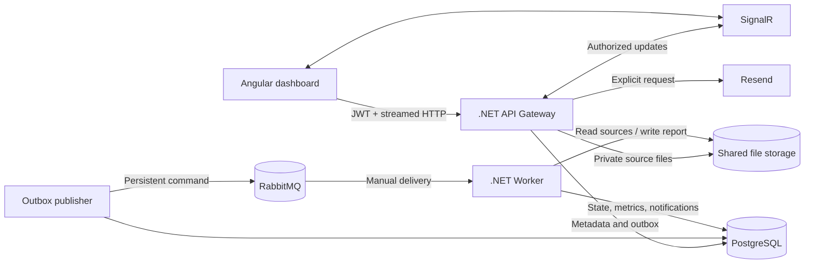

<div align="center">

# FileReport

**Compare large CSV files through a secure, asynchronous, and observable workflow.**

Angular dashboard · .NET Minimal API · RabbitMQ worker · PostgreSQL · SignalR


[Quick start](#quick-start) · [Architecture](#architecture) · [Development](#development) · [Specifications](specs/requirements.md)

</div>

## Overview

FileReport compares a **Baseline** CSV with a **Candidate** CSV without tying processing to an HTTP request. Users choose one or more key columns, follow the job in real time, and inspect a dashboard with validation metrics and deterministic comparison results.

| Result | Meaning |
| --- | --- |
| **Added** | The key exists only in Candidate |
| **Removed** | The key exists only in Baseline |
| **Changed** | The key exists in both files and at least one selected value differs |
| **Unchanged** | The key and all selected values are identical |

Differences are successful comparison results. Invalid input produces an explicit failed job and cannot be presented as a complete report.

## Highlights

- **Large-file design:** streamed uploads, private file storage, bounded parsing, external sorting, and merge comparison.
- **Asynchronous processing:** transactional outbox, RabbitMQ quorum queue, DLQ, manual acknowledgments, finite retries, leases, and fencing.
- **Secure ownership:** JWT authentication and owner checks for jobs, files, reports, artifacts, email requests, and SignalR subscriptions.
- **Live dashboard:** Angular Material, Chart.js, SignalR progress, polling recovery, job history, samples, and downloadable results.
- **Explicit email delivery:** Resend is invoked only after **Send by email**; registration and job completion do not send automatic email.
- **Observable results:** each report distinguishes volume, elapsed time, memory observations, failures, and cost availability.
- **Reproducible delivery:** pinned dependencies, EF Core migrations, separate Dockerfiles, Docker Compose, and GitHub Actions validation.

## Architecture



The backend follows DDD boundaries:

```text
Domain <- Application <- Infrastructure
                    ^-- API
                    ^-- Worker
Contracts <------------ API
```

The Domain project has no framework dependencies. Application defines use cases and ports; Infrastructure implements persistence, storage, processing, messaging, telemetry, and email. API and Worker remain separate executable hosts.

### Processing flow

1. The authenticated user creates a draft comparison.
2. Baseline and Candidate are uploaded as separate streams to private storage.
3. The user selects key/comparison columns and submits an immutable job configuration.
4. PostgreSQL commits the job and outbox command atomically.
5. RabbitMQ delivers the command to a worker.
6. The worker validates each CSV, creates bounded sort runs, and merge-compares both inputs.
7. The worker publishes counts, metrics, bounded samples, and a full JSON Lines artifact.
8. The dashboard receives persisted progress through SignalR and recovers missed events through HTTP.

## Technology

| Area | Stack |
| --- | --- |
| Frontend | Angular 22, Angular Material, Chart.js, SignalR client, TypeScript |
| API | .NET 10, ASP.NET Core Minimal APIs, JWT bearer authentication, SignalR |
| Architecture | DDD with Domain, Application, Infrastructure, Contracts, API, and Worker projects |
| Persistence | PostgreSQL 18, EF Core 10, Npgsql, versioned migrations |
| Messaging | RabbitMQ 4, durable quorum queue, dead-letter exchange and DLQ |
| Processing | Separate .NET worker, strict CSV parser, bounded external sort and merge |
| Observability | Structured JSON logs, OpenTelemetry, persisted job/attempt metrics |
| Frontend checks | Prettier, Angular production build, colocated Vitest specs |
| Delivery | Dockerfiles, Docker Compose, GitHub Actions |

Exact dependency versions are pinned in [Directory.Packages.props](Directory.Packages.props), NuGet lockfiles, and the [frontend lockfile](web/filereport-ui/package-lock.json).

## Quick start

### Requirements

- Docker Desktop or Docker Engine with Compose.
- Three distinct random secrets of at least 32 bytes.

### 1. Configure the environment

Copy [.env.example](.env.example) to `.env` without overwriting an existing file, then set:

```dotenv
POSTGRES_PASSWORD=<random-database-secret>
RABBITMQ_PASSWORD=<random-broker-secret>
JWT_SIGNING_KEY=<random-signing-key>
```

Generate a value with either command:

```bash
openssl rand -hex 32
```

```powershell
[Convert]::ToHexString([Security.Cryptography.RandomNumberGenerator]::GetBytes(32))
```

> Keep the original PostgreSQL and RabbitMQ passwords when reusing existing Docker volumes. Never commit `.env`.

### 2. Start the stack

```bash
docker compose up -d --build --wait
```

| Service | Address |
| --- | --- |
| Web application | <http://localhost:8080> |
| API Gateway | <http://127.0.0.1:5080> |
| PostgreSQL | `127.0.0.1:55432` |
| RabbitMQ AMQP | `127.0.0.1:55672` |
| RabbitMQ management | <http://127.0.0.1:55673> |

Compose starts storage initialization and applies EF Core migrations before the API and worker become available.

### 3. Stop the stack

```bash
docker compose down
```

This retains named volumes. Add `--volumes` only when you intentionally want to remove local database, broker, and file data.

## User workflow

1. Register or sign in. Account creation does not require email confirmation.
2. Choose Baseline and Candidate CSV files.
3. Select each file's delimiter and source encoding, then choose the composite key and optional comparison columns.
4. Submit the job and monitor upload/processing status.
5. Inspect charts, file-quality metrics, counts, samples, and attempt history.
6. Download the differences artifact or explicitly request an email summary.

CSV row order does not affect matching. UTF-8 is the default; Windows-1252 and UTF-16 can be selected independently for Baseline and Candidate and are transcoded as bounded streams. Values use exact ordinal string comparison; there is no silent encoding fallback, implicit trimming, type conversion, fuzzy matching, or automatic key inference.

## API surface

| Method and path | Purpose |
| --- | --- |
| `POST /api/v1/auth/register` | Create an account without email confirmation |
| `POST /api/v1/auth/login` | Issue a short-lived JWT |
| `GET /api/v1/auth/me` | Return the authenticated identity |
| `POST /api/v1/comparisons` | Create a comparison draft |
| `PUT /api/v1/comparisons/{id}/files/{side}` | Stream Baseline or Candidate |
| `GET /api/v1/comparisons/{id}/schema` | Inspect available columns |
| `PATCH /api/v1/comparisons/{id}/options` | Set keys and comparison options |
| `POST /api/v1/comparisons/{id}/submit` | Submit immutable work |
| `GET /api/v1/comparisons/{id}/report` | Read the authorized result |
| `GET /api/v1/comparisons/{id}/artifacts/{artifactId}` | Download the result artifact |
| `POST /api/v1/comparisons/{id}/email` | Request explicit email delivery |
| `/hubs/comparisons` | Receive authorized SignalR events |

Mutation endpoints use revisions and/or idempotency keys where required. Errors use Problem Details with stable English codes and trace IDs.

## Development

### Direct build and frontend checks

The repository uses native tool commands; no helper-script directory is required.

```powershell
dotnet restore FileReport.slnx --locked-mode --configfile NuGet.Config
dotnet build FileReport.slnx --no-restore --configuration Release
dotnet format whitespace FileReport.slnx --no-restore --verify-no-changes

npm ci --prefix web/filereport-ui
npm --prefix web/filereport-ui run format:check
npm --prefix web/filereport-ui run build
npm --prefix web/filereport-ui test
```

The repository intentionally contains no backend test projects. CI restores and builds the backend, checks formatting, validates the frontend, and builds all application images without creating test-result directories or artifacts.

<details>
<summary><strong>Run API, worker, and Angular directly</strong></summary>

Start only PostgreSQL and RabbitMQ:

```powershell
docker compose up -d --wait postgres rabbitmq
```

API and Worker share a `UserSecretsId`. Configure local `ConnectionStrings:Database`, `RabbitMq:*`, `Jwt:*`, `Storage:Root`, `Email:*`, and `Cors:Origin` values through `dotnet user-secrets` on the API project. The complete key list and container equivalents are visible in [.env.example](.env.example) and [docker-compose.yml](docker-compose.yml). Environment variables override User Secrets.

```powershell
$env:DOTNET_ENVIRONMENT = 'Development'
dotnet run --project src/FileReport.Api -- --migrate
dotnet run --project src/FileReport.Api -- --urls http://127.0.0.1:5080
```

In separate terminals:

```powershell
$env:DOTNET_ENVIRONMENT = 'Development'
dotnet run --project src/FileReport.Worker
```

```powershell
npm --prefix web/filereport-ui start
```

Open <http://localhost:4200>. Both .NET hosts must use the same absolute `Storage:Root`. Do not mix native and container hosts against jobs created in different file stores.

See [Microsoft's User Secrets guidance](https://learn.microsoft.com/en-us/aspnet/core/security/app-secrets?view=aspnetcore-10.0) for local configuration semantics.

</details>

## Repository structure

```text
.
├── .github/workflows/         # CI validation
├── config/                    # Processing, RabbitMQ, and Nginx settings
├── specs/                     # Requirements, design, and implementation tasks
├── src/
│   ├── FileReport.Domain/
│   ├── FileReport.Application/
│   ├── FileReport.Infrastructure/
│   ├── FileReport.Contracts/
│   ├── FileReport.Api/
│   └── FileReport.Worker/
├── web/filereport-ui/         # Angular application
├── docker-compose.yml
└── FileReport.slnx
```

## Configuration and safeguards

[processing.defaults.json](config/processing.defaults.json) defines upload, parser, sort, scratch, retry, lease, sampling, concurrency, and retention limits. Environment variables use the standard double-underscore notation, for example `Processing__MaxFileBytes`.

Configured limits are safety boundaries to evaluate. They do not establish supported capacity, memory use, throughput, or latency.

## Validation status

The comparison pipeline, container definitions, and CI workflow are present. The latest retained validation produced:

- Backend build and formatting: passed.
- Backend automated test projects were removed by the current repository scope.
- Frontend formatting, build, and colocated tests passed.
- Native API startup and liveness with User Secrets: passed.
- Compose configuration and CI YAML syntax: passed.

Remote execution of the simplified build-only CI, browser end-to-end validation, real Resend configuration, and production readiness remain unverified. The Angular production build currently reports an initial-bundle budget warning.

## Security and measurement policy

- Never commit `.env`, User Secrets, source CSVs, reports, or generated runtime data.
- Local email mode defaults to `Fake`; registration and job completion do not send automatic email.
- Account email ownership is unverified, so production use requires abuse controls and sender-domain configuration.
- A local shared volume and a single Gateway do not establish multi-host availability.
- No throughput, latency, memory, maximum file size, availability, or monetary-cost guarantee is claimed before reproducible measurement.
- Missing measurements and prices remain **Unavailable**, never fabricated as zero.

## Project documentation

| Document | Purpose |
| --- | --- |
| [Requirements](specs/requirements.md) | Product scope, functional/nonfunctional requirements, and acceptance criteria |
| [System design](specs/design.md) | Architecture, contracts, state model, processing, recovery, and measurement design |
| [Implementation tasks](specs/tasks.md) | Dependency-aware backlog and requirement traceability |
| [Application knowledge](codex.md) | Consolidated decisions and contributor context |

The implementation backlog remains open until each task's exit criteria has evidence. A working scaffold or adapter does not by itself close acceptance.

## License

No license has been selected for this repository. Until one is added, copyright law applies and reuse rights are not granted.
