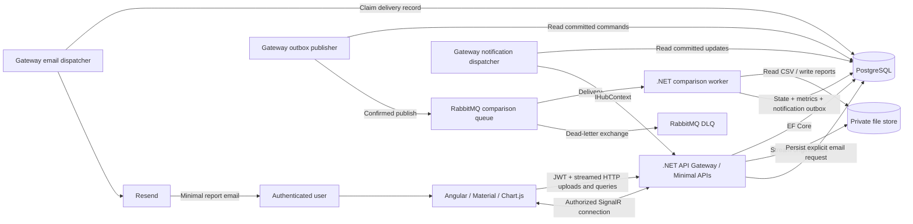
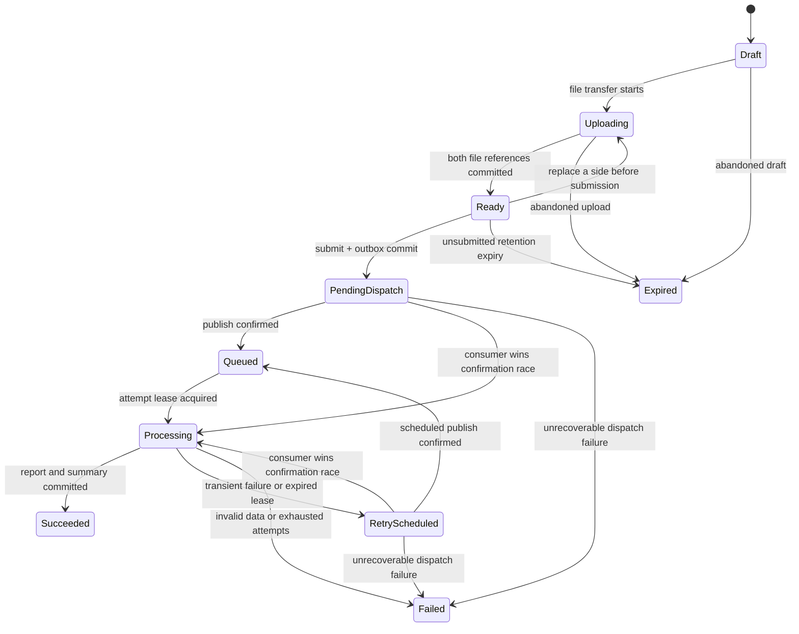

# FileReport — System Design

Status: Comparison pipeline implemented; full acceptance remains open. See [README](../README.md) for current capabilities, verification commands, and limitations. No validated performance envelope has been established.  
Related specifications: [Requirements](requirements.md) and [Implementation tasks](tasks.md).

## 1. Design decisions

| Decision | Initial choice and consequence |
| --- | --- |
| Comparison unit | Two CSVs, Baseline and Candidate, matched by an explicit unique key. Each file also has validation metrics. |
| API Gateway | An ASP.NET Core application entry point/BFF using Minimal APIs and DDD layers. It owns authentication, upload orchestration, queries, RabbitMQ publication, and SignalR. No separate proxy product is required. |
| Long-running work | A separate .NET Worker Service consumes RabbitMQ commands and writes authoritative state/results to PostgreSQL. Browser/request lifetimes do not own processing. |
| Storage | Private files through `IFileStore`; a shared persistent volume for the initial single-host deployment. PostgreSQL stores metadata/results rather than entire CSV blobs or permanently imported rows. |
| Comparison algorithm | Streaming parse, bounded external sort, then merge comparison. This is a candidate implementation to measure, not a speed or memory claim. |
| Consistency | PostgreSQL transactions, outbox publication, idempotent consumers, fenced processing leases, and immutable artifacts. No distributed transaction or exactly-once transport assumption. |
| Real-time updates | SignalR connects on file selection; HTTP carries file bytes. A Gateway dispatcher relays persisted worker updates to connected owners. HTTP snapshots recover missed notifications. |
| UI | Angular Material and Chart.js; English throughout. |
| Email | Resend from a background dispatcher in the Gateway, only after **Send by email**. A delivery record has its own status and retry lifecycle. |
| Versions | Select supported, mutually compatible releases during scaffolding and pin them. This design does not assert that any unspecified library versions work together. |

Requirements FR-001–FR-013 and NFR-001–NFR-010 define acceptance. The choices here are project decisions; official references cited below support framework behavior, not measured project performance.

## 2. Components and data flow



The publisher, notification dispatcher, email dispatcher, and recovery/cleanup scheduler are hosted application services. They use bounded batches, database leases, cancellation, and dependency backoff. They are not fire-and-forget tasks attached to requests. The worker has no public HTTP API except restricted operational health/metrics endpoints where needed.

## 3. DDD and code organization

Repository structure after consolidation of local configuration and removal of generated/placeholder directories:

```text
src/
  FileReport.Domain/
  FileReport.Application/
  FileReport.Infrastructure/
  FileReport.Contracts/
  FileReport.Api/
  FileReport.Worker/
web/
  filereport-ui/
config/
specs/
.github/workflows/
docker-compose.yml
README.md
codex.md
```

Use direct .NET, npm, and Docker Compose commands documented in README; no helper-script directory is required. Compose reads root `.env` with mandatory private credentials. API and worker share a native .NET `UserSecretsId` for Development; environment variables override that configuration. The root backend `tests` directory was removed by explicit scope decision on 2026-08-31 and must not be recreated without another scope change. Colocated Angular specifications remain. CI performs formatting, build, Compose, and image validation without generating test-result or cache directories in the repository. Backend correctness, recovery, and infrastructure acceptance evidence therefore remain open gaps.

- **Comparisons context:** `ComparisonJob` is the aggregate root controlling owner, file slots, immutable submitted options, state transitions, current attempt, and final report reference. `ComparisonOptions`, `CompositeKey`, and classified differences express domain rules. `ProcessingAttempt` preserves execution history. Do not load all rows or samples into the aggregate.
- **Identity context:** ASP.NET Core Identity supplies account/password infrastructure. JWT issuance is an application use case. Identity framework entities stay out of comparison domain rules.
- **Notifications context:** `EmailDelivery` records a requested summary delivery. Comparison success does not depend on email success.
- **Application:** use cases such as `CreateComparison`, `UploadFile`, `SubmitComparison`, `ProcessComparison`, `GetReport`, and `RequestReportEmail`; ports such as `IFileStore`, `ICsvRecordReader`, `IExternalSorter`, repositories, `IClock`, and `IEmailSender`.
- **Infrastructure:** EF Core/Npgsql mappings, migrations, streamed storage, the selected CSV parser, external-sort files, RabbitMQ client, Resend adapter, and telemetry adapters.
- **Hosts:** API endpoints and the worker consumer validate transport contracts and call use cases. The API is not where comparison algorithms run.
- **Contracts:** versioned HTTP/event DTOs and safe error codes. Do not serialize EF entities or domain aggregates onto the wire.

Dependency direction: Domain has no framework dependencies; Application depends on Domain; Infrastructure implements application ports; API/Worker compose them. Contracts do not expose infrastructure types. Prefer a small modular system with these boundaries over a separate service for every entity. The supported Angular test tooling validates colocated frontend specifications; backend verification is currently limited to formatting and compilation.

## 4. Data model and persistence

| Record | Essential data and constraints |
| --- | --- |
| User | Identity ID, unique normalized email, password hash, timestamps; email confirmation not required |
| ComparisonJob | UUID, owner ID, state, stage, revision, options/schema version, immutable file IDs after submission, current attempt number, lease generation, safe failure code, lifecycle timestamps, final report ID |
| StoredFile | UUID, job/side, slot generation, generated storage key, original display name, actual bytes, checksum, upload state/timestamps, retention deadline; one active file per job/side |
| ProcessingAttempt | Job/attempt number, input/options version, worker instance, lease token/expiry, heartbeat, timing, metrics, error category/code, retry eligibility; unique `(jobId, attemptNumber)` |
| ComparisonReport | One authoritative final report per job, outcome counts, per-file validation summaries, schema/options version, artifact references, completeness flags |
| ResultSample / ErrorSample | Job/attempt, bounded sequence, classification or safe error code, record location, bounded owner-visible detail; configured row and byte caps |
| ReportArtifact | Generated key, content type, checksum, actual bytes, attempt/fence, lifecycle state and retention deadline |
| OutboxMessage | UUID, destination (`RabbitMq` or `SignalR`), schema version, job/attempt/revision, small payload, `availableAt`, claim lease, publish attempts, confirmation/dispatch state |
| ConsumerReceipt | Message ID and durable disposition; prevents duplicate effects, but must not suppress recovery of an unfinished attempt |
| EmailDelivery | Owner/job, immutable recipient and template snapshot, request key/hash, provider key/ID, status, attempts, next retry time, safe error, timestamps |
| BenchmarkRun / CostEstimate | Environment/configuration references, measurement provenance, coverage/completeness, usage, rate-card version, currency, component estimates and attribution method |

Use PostgreSQL `bigint` for byte/record counters, UTC `timestamptz` for stored instants, and explicit units for durations. Use decimal arithmetic for money. Reports return nullable measurements with availability/completeness metadata. If counters can exceed JavaScript's safe integer range, serialize them as decimal strings; chart aggregates must not silently lose precision.

Index jobs by owner/creation time and state; outbox by destination/state/available time; attempts by job/number; samples by job/sequence. Use optimistic revision checks for aggregate transitions, unique constraints for idempotency, and short database transactions. Configure migrations and bounded query/page sizes. Never use EF tracking as a buffer for the CSV dataset.

Raw row values may occur in owner-authorized report samples/artifacts; they must not enter operational logs, message headers, or time-series labels. Sample row counts alone do not bound storage: cap field lengths and total sample bytes and mark truncation.

## 5. Upload and submission lifecycle

1. On file selection, Angular starts the JWT-authenticated SignalR connection and sends `POST /api/v1/comparisons` to create a draft. The browser holds `File` objects, not whole-file strings/arrays.
2. With the returned job ID, the client calls `SubscribeToJob(jobId)`. The Gateway checks ownership, joins the connection to a server-generated group, and returns the current snapshot/revision. The client retains only the newest revision across this response and concurrent events.
3. The client uploads each side through a separate HTTP multipart request. In degraded hub mode it proceeds with polling and an explicit connection warning.
4. The Gateway reserves the slot using its current generation, streams the one allowed file part into a generated temporary key, enforces byte/time/storage limits, and computes the checksum while writing. It emits throttled, server-received-byte progress. Do not use `ReadToEnd`, whole-file `MemoryStream`, or form model binding that buffers the complete upload.
5. A completed file is finalized to an immutable key, then its metadata and job revision are committed. Only committed file references are eligible for processing. The second completed side changes the job to `Ready`.
6. The client obtains bounded header previews, selects key/compared columns and per-file delimiter options, and submits. Header preview is advisory; the worker remains responsible for complete validation.
7. Submission validates ownership, readiness, and options; freezes the input/options version and finite attempt budget; and commits `PendingDispatch` plus `ComparisonRequested` in one PostgreSQL transaction. The endpoint returns `202 Accepted` with the status URL.
8. The publisher claims due outbox entries, publishes to RabbitMQ, and records confirmation. A conditional transition sets `Queued` only if the job is still `PendingDispatch` or an eligible retry. A fast worker may already be processing; a late publisher update must never regress its state.

HTTP streaming is an explicit upload implementation choice; ASP.NET Core distinguishes it from buffered form-file handling. Validate every size limit across the reverse proxy, Kestrel, multipart reader, and file store. [ASP.NET Core file upload guidance](https://learn.microsoft.com/en-us/aspnet/core/mvc/models/file-uploads?view=aspnetcore-10.0).

Browser progress reports request transfer, not durable storage. Select Angular's supported XHR-backed HTTP transport when upload progress is required; its fetch backend does not report upload progress events. [Angular HTTP progress documentation](https://angular.dev/guide/http/making-requests).

File finalization and a database commit are not atomic together. Failed commits can leave orphans; failed writes leave partial objects. A reconciler removes only unreferenced files after a grace period and checks upload/processing/download leases before cleanup. Concurrent uploads to the same side use conditional generation checks; the losing operation cannot replace the committed file. Uploads may be retried from the beginning; resumable upload is deferred.

### Job state machine



Per-file states are `Pending`, `Uploading`, `Stored`, and `Failed`. A failed upload can be retried while the job stays unsubmitted; it does not become a processing failure. `RetryScheduled` carries the next attempt and due time. Recovery may move an exhausted `Processing` attempt directly to `Failed` after a crash. Physical broker dead-lettering is a separate disposition, not a replacement for a persisted job outcome. Artifact expiry never changes historical `Succeeded`/`Failed` states.

## 6. RabbitMQ, outbox, and recovery

### Topology and command

| Resource | Definition |
| --- | --- |
| `filereport.commands` | Durable direct exchange |
| `filereport.comparisons.process` | Durable quorum processing queue, bound with `comparison.requested.v1` |
| `filereport.deadletter` | Durable direct dead-letter exchange |
| `filereport.comparisons.dlq` | Durable quorum queue, bound with `comparison.failed.v1`; no automatic route back |
| Queue policies | Source DLX/routing key, explicit length/byte limits, delivery limit, and at-least-once dead-letter strategy with required compatible settings |

Retry delays use `OutboxMessage.availableAt` in PostgreSQL, not an undeclared RabbitMQ delayed-message plugin or an implicit TTL retry queue.

`ComparisonRequested.v1` contains `messageId`, `schemaVersion`, `jobId`, `attemptNumber`, `inputVersion`, `createdAtUtc`, and trace context. The consumer retrieves trusted file references from PostgreSQL. No tokens, arbitrary URLs, CSV bodies, or raw error details enter the command. A retry gets a new message ID and attempt number; republishing the same outbox entry keeps its message ID.

Use persistent messages, publisher confirms, mandatory routing/return handling, and manual consumer acknowledgments. Broker acceptance and consumer completion are separate events. Duplicate delivery is expected. [RabbitMQ acknowledgments and publisher confirms](https://www.rabbitmq.com/docs/confirms).

Quorum dead-letter transfer must explicitly enable `dead-letter-strategy=at-least-once`, `overflow=reject-publish`, a valid DLX/binding, and any prerequisites of the pinned broker version. Default dead-letter transfer is not assumed lossless. Test a missing/unavailable target and alert on retained backlog. A one-node development broker is not a highly available cluster. [RabbitMQ quorum queue dead-lettering](https://www.rabbitmq.com/docs/quorum-queues), [RabbitMQ DLX safety](https://www.rabbitmq.com/docs/dlx).

### Attempt ownership and acknowledgment

- Claim the scheduled attempt with a database compare-and-swap. Persist worker identity, a renewable lease, and a monotonically increasing fencing token. Every progress/final write checks that token and the job's current attempt.
- Hold no database transaction for the full comparison. Record bounded progress snapshots and heartbeats in short transactions. Start with one active job and prefetch one per worker as a conservative configuration to evaluate, not a validated capacity limit.
- A duplicate for a terminal successful or validation-failed attempt is acknowledged without rerunning work. A duplicate for an active lease cannot acquire execution ownership. A stale attempt/message cannot overwrite a newer attempt.
- On success, finalize artifacts, then commit the report pointer, counters, terminal state, consumer disposition, and notification outbox atomically in PostgreSQL. Acknowledge only after that commit. Files left by a losing/failed attempt remain unreferenced and eligible for cleanup.
- On a deterministic CSV validation failure, commit `Failed` plus available diagnostics and acknowledge. Such failures are user data outcomes, not poison messages.
- On a transient processing failure, commit the failed attempt and next scheduled command in the same transaction, then acknowledge the old delivery. If the transaction fails, do not acknowledge; pause consumption/back off on infrastructure outages.
- Start with a configurable maximum of three processing attempts and retry delays of 5 and 30 seconds plus bounded jitter. These are initial recovery-policy choices, not performance claims. Persist counts and due times across restarts. Do not retry invalid input with unchanged bytes/options.
- Poison/unsupported commands and exhausted processing faults are rejected with `requeue=false` into the DLX. First persist a safe known-job failure and a dead-letter intent where possible. If a crash happens between intent and rejection, redelivery completes rejection rather than acknowledging it away. Unidentifiable poison commands have infrastructure diagnostics without a fabricated job ID.
- A recovery scheduler checks expired worker leases, unconfirmed/stale dispatches, and missing terminal writes. Each lost execution consumes an attempt, then schedules the next one or a final rejection command through the outbox. A fenced-out worker stops and cannot publish authoritative results.
- Long-running deliveries require a broker consumer-acknowledgment timeout compatible with the enforced job execution timeout plus a safety margin. Broker heartbeats do not extend that timeout. Record both settings; test the boundary, network loss, process kill, and graceful shutdown.

The outbox publisher retries unconfirmed publication with backoff; routing/configuration failures are alerted and surfaced instead of marking a job queued. Operational repair must preserve the original command identity. Duplicate receipts are not allowed to hide an expired lease or a pending dead-letter intent.

DLQ monitoring records actual queue depth and dead-letter reasons separately from application requests to dead-letter. Replay is an operator command after diagnosing the cause; it creates a new linked comparison operation with an audited retry budget and original input availability checks. No public replay endpoint is required.

## 7. CSV analysis and comparison algorithm

The interpretation contract in FR-004/FR-005 is normative. Store its version with the job and report so a later parser/policy change does not silently alter historical meaning.

1. Open immutable source streams and verify stored length/checksum during the read. Configure the selected CSV parser for UTF-8, the chosen delimiter, required headers, quotes, and multiline records. Enforce maximum columns, bytes per field/record, and decoded buffer size as parsing proceeds.
2. Validate matching header sets; map columns by exact header name, not position. Remove a UTF-8 BOM only at the beginning of a file. Validate blank records rather than skipping them; a final record terminator does not create an extra record. Reject structural problems with stable codes such as `InvalidEncoding`, `MalformedRecord`, `SchemaMismatch`, `EmptyKey`, and `RecordLimitExceeded`.
3. Parse records into bounded sort chunks containing a length-prefixed composite key, selected comparison values, and source record location. Compare composite keys component by component using ordinal string order. Raw delimiter concatenation and process-randomized string hashes are not identities.
4. Sort each bounded chunk and spill it to attempt-specific scratch files. Merge runs with bounded fan-in and bounded open handles; perform additional merge passes when needed. No dictionary of every file key and no whole-file array is allowed.
5. Detect adjacent equal keys within the final sorted stream for each side, including keys spanning different runs. Any duplicate invalidates the comparison. Reports written before all validation completes remain temporary and are never published as successful.
6. Merge the sorted Baseline and Candidate streams. Classify keys using FR-005; compare actual selected string values, not only row hashes. Record changed-column counts and stream differences to a report artifact.
7. Maintain counters and capped samples while processing. The full artifact is a versioned JSON Lines stream containing added/removed/changed records; unchanged rows appear only as aggregate counts. HTML-escape rendered values. CSV exports are deferred; any later spreadsheet-compatible export must address formula injection separately without changing comparison semantics.
8. After both streams finish successfully, check count invariants, close/hash artifacts, and publish their references with the final report transaction. Delete temporary runs when safe, including on restart or failure.

For `N` total records, external sorting adds comparison and I/O work dependent on key width, memory budget, run count, and storage. Scratch/output space can grow with input and difference volume. A bounded parser/sort plan does not imply a fixed measured resident-memory value. Enforce scratch/output limits and distinguish `ResourceLimitExceeded` from unexpected I/O failures; do not keep retrying a deterministic quota failure.

Validation diagnostics are bounded. Record logical CSV record numbers, and physical line/byte locations only when the parser can provide them accurately. A fatal parse error stops that scan; unknown remaining totals stay unknown. No failed attempt's provisional difference counters are presented as a complete report.

## 8. HTTP, SignalR, and email contracts

### HTTP surface

All resource routes except registration/login and operational probes require JWT authentication. The foundation also exposes public, non-sensitive capability metadata through GET /api/v1/system; it contains no user/job data and explicitly reports unavailable capabilities. Owner checks apply to each resource route. Errors use Problem Details with stable English `code` and `traceId`, without stack traces or CSV contents.

| Method and route | Purpose / principal response |
| --- | --- |
| `POST /api/v1/auth/register` | Create an account without confirmation email; `201` |
| `POST /api/v1/auth/login` | Return access token and expiry; `200` |
| `GET /api/v1/auth/me` | Current identity; `200` |
| `GET /api/v1/system` | Non-sensitive application stage/capability metadata; `200` |
| `POST /api/v1/comparisons` | Create draft; `201` with job ID and revision |
| `PUT /api/v1/comparisons/{id}/files/{side}` | Stream one file; side is `baseline` or `candidate`; conditional slot update |
| `GET /api/v1/comparisons/{id}/schema` | Bounded, advisory header previews and format diagnostics |
| `PATCH /api/v1/comparisons/{id}/options` | Update unsubmitted key/column/delimiter options using revision precondition |
| `POST /api/v1/comparisons/{id}/submit` | Idempotent submission; `202` plus `Location` status URL |
| `GET /api/v1/comparisons` | Cursor-paginated owner history |
| `GET /api/v1/comparisons/{id}` | Authoritative state, progress, metrics availability, revision |
| `GET /api/v1/comparisons/{id}/report` | Final summary or explicit not-ready/failed status |
| `GET /api/v1/comparisons/{id}/samples` | Capped, paginated difference/error samples with truncation flags |
| `GET /api/v1/comparisons/{id}/artifacts/{artifactId}` | Owner-authorized streamed artifact; expired artifact returns `410` |
| `POST /api/v1/comparisons/{id}/email` | Idempotent explicit send request; `202` and delivery ID |
| `GET /api/v1/email-deliveries/{id}` | Owner-authorized delivery status |
| `/hubs/jobs` | Authenticated SignalR hub |

Use `Idempotency-Key` for draft creation, submission, and email requests; scope persisted keys to owner/operation and store a request hash. Upload/options mutations use a revision/slot precondition and reject stale or concurrent writes. Distinguish `400` malformed request, `401` unauthenticated, `404` inaccessible resource, `409` state/idempotency conflict, `412` failed precondition, `413` size limit, `422` invalid options, and `429` rate limit. Worker-discovered data errors are job outcomes after the accepted submission.

### Real-time delivery path

The worker commits progress and a small notification outbox entry to PostgreSQL. A dispatcher in the Gateway reads committed entries and invokes that Gateway's `IHubContext<JobHub>`. A worker's local hub context cannot reach connections hosted by a different process.

`JobUpdated.v1` carries `{ jobId, revision, state, stage, attemptNumber, bytesRead, recordsRead, occurredAtUtc, metricsComplete, errorCode }`. Upload updates also identify the side and received bytes. The client uses revisions, not timestamps, to reject stale events. Progress checkpoints and event frequency are configurable/coalesced; terminal updates are persisted without waiting for the next progress interval. Multi-pass processing exposes stage counters rather than an invented global percentage.

SignalR is a notification channel, not the durable source of truth. Marking an outbox update dispatched does not prove a browser received it. After connecting/reconnecting, join the authorized group and reconcile with HTTP snapshots; bounded polling remains available. Disconnecting or logging out does not cancel a submitted job.

Use the JWT client's access-token factory, restrict query-string token acceptance to the hub route where browser transports require it, redact it at every proxy/logger, and close connections at authentication expiry. Group names are server-generated and membership is rechecked on subscription. [SignalR authentication guidance](https://learn.microsoft.com/en-us/aspnet/core/signalr/authn-and-authz?view=aspnetcore-10.0).

The first release has one Gateway instance. Before scaling it, introduce and test a supported SignalR backplane/managed service and required load-balancer affinity; database polling alone does not broadcast to all instances' clients. [SignalR hosting and scale-out](https://learn.microsoft.com/en-us/aspnet/core/signalr/scale?view=aspnetcore-10.0).

### Email delivery

The button is enabled for a successful, accessible report. Its request contains no arbitrary recipient or email body. The Gateway reads the account email, snapshots an English aggregate summary and authenticated report URL, and persists `EmailDelivery(Pending)`. The dispatcher claims it, calls Resend, and records provider acceptance or a safe failure. Email failure never changes comparison success.

Use one stable provider idempotency key per delivery and bound automatic retries to the provider's verified retention window. Resend currently documents a 24-hour deduplication window; recheck this when implementing. A timeout or a crash after provider acceptance leaves an uncertain outcome to reconcile within that window. Afterward, mark it `Unknown` and require an explicit new user send instead of blindly retrying. [Resend idempotency keys](https://resend.com/docs/dashboard/emails/idempotency-keys).

Account email ownership is unverified by request. Limit recipients to the account address, rate-limit sends, omit raw data and filenames, and warn users to check the destination. Configure a verified sender domain and a server-side sending key. Provider acceptance is displayed as `Accepted`; verified webhook handling would be needed for a later `Delivered` state.

## 9. Metrics and measurement boundaries

Persist job summaries and attempt-level metrics; export service metrics and correlated traces separately. Initialize missing values as unavailable, not zero. Record the tool, units, sample interval, environment, and whether a value is observed, calculated from observations, estimated, or incomplete.

| Metric | Definition and reporting rule |
| --- | --- |
| Input volume | Per-side actual file bytes and checksum. Unique job input bytes are Baseline + Candidate counted once, not multiplied by retries. Report bytes and explicitly labeled MiB/GiB or decimal GB. |
| Records | Logical data records excluding the header. Record observed/valid/invalid counts per file/attempt, and mark totals unknown if scanning stops early. |
| Physical I/O | Actual source, sort-run, merge, and report bytes read/written, including repeated passes. Aggregate across attempts separately from unique input volume. |
| Upload elapsed | First server upload start to both files committed, plus individual upload durations. This can include gaps between uploads; browser transfer timing is a separate observation. |
| Submitted-job total | `terminalAt - submittedAt`, including dispatch, queue wait, all attempts, retry waits, and final report persistence. It excludes upload and later email delivery. Unfinished runs report observation duration, not a terminal total. |
| Server-observed full workflow | `terminalAt - firstUploadStartedAt`; includes upload and any time the user spends configuring/submitting. Label this distinctly; it is not pure processing time. |
| Dispatch and queue delay | For each command, store scheduled/due, first publish attempt, broker confirmation if observed, and worker start. Report dispatch and broker-to-worker delay only when their timestamp boundaries are known; otherwise retain combined submit/due-to-worker delay. A missing confirmation never yields a fabricated negative wait. |
| Attempt/stage elapsed | Monotonic timers for validation, sort, merge, report finalization, and database persistence; record overlaps if stages run concurrently. Also preserve UTC boundaries for correlation. Sum of overlapping stage times is not wall time. |
| Throughput | Optional derived bytes/records per second with the exact numerator and elapsed interval. Do not divide by zero or treat failed/incomplete runs as successful throughput. |
| Memory | Sample process working set/RSS, managed heap, and container memory separately for API and worker; collect database/broker resources separately. Record observed peak, interval, source, baseline, and gaps. Allocated bytes are allocation traffic, not live memory. |
| CPU and scratch | Process/container CPU time, scratch high-water bytes, full-artifact bytes, and relevant disk/network counters, with attribution boundaries. |
| Failures | Validation codes, storage/quota errors, dispatch faults, worker crashes/OOM/timeouts, attempt count, redelivery count, scheduled retries, final outcome, and actual DLQ depth/reasons. Differences between valid CSVs are not failures. |
| Delivery | Requested, attempted, accepted, failed, unknown email counts; provider ID and duration; never infer inbox delivery from acceptance. |

Synchronize service clocks and document cross-process timestamp uncertainty. Use monotonic timers inside a process; do not derive reliable stage durations from adjustable wall clocks. Do not sum independent services' peak memory values and label that sum a simultaneous system peak.

Initial per-job memory measurements should run one active comparison per worker with an idle baseline. At higher concurrency, process/container measurements are shared; do not claim exact per-job memory attribution. Use an external sampler to retain observations if a worker is OOM-killed. A sampled peak can miss short spikes; an interrupted trace has lower completeness, not zero resource usage. Instrumentation overhead must be recorded with the workload.

Structured logs/traces include correlation ID, job ID, attempt, message ID, stage, and stable error code. Metric labels remain low-cardinality (service, stage, outcome, failure category), excluding job/user IDs, filenames, and row values. Operational views include outbox age, queue depth/oldest-message age, active/expired leases, retries, DLQ depth, storage pressure, request failures, and email failures. Alert thresholds begin as explicit operational settings and are tuned using measurements.

### Cost model

Store a versioned rate card with provider/product/region, source URL or contract reference, retrieval date, currency, billing unit, tier/free allowance, and shared-resource allocation rule. This specification selects no provider and assigns no prices.

```text
component_estimate = measured_billable_usage * applicable_unit_rate
job_estimate = direct_component_estimates + allocated_shared_component_estimates
cost_per_input_GB = job_estimate / ((baseline_bytes + candidate_bytes) / 1_000_000_000)
```

Apply tiers and minimum/fixed charges where relevant; the multiplication is a component model, not a universal pricing formula. Estimate compute (including retries), database, RabbitMQ, original/result storage retention, temporary disk, network egress, telemetry, and email separately. CPU time and peak memory are not automatically a cloud provider's billing units. Reserved resource-hours and idle service costs require an explicit allocation policy; report unallocated shared costs too.

If any required rate/usage is unknown, total estimated cost is unavailable; a known-component subtotal must be labeled partial. Never divide by zero input bytes. Show per-run cost, per-GB denominator, and fixed environment cost separately. An eventual billing export is reconciliation evidence, not something this application already has. Local runs still consume resources, even without a cloud invoice.

## 10. Benchmark protocol and evidence

Before any performance claim, build a deterministic fixture generator and correctness oracle for small fixtures. Store seeds, schema, actual bytes/records, checksums, expected counts, command lines, and configuration. Generate large datasets outside normal PR tests and do not commit large CSVs or secrets.

The candidate workload matrix spans small correctness fixtures and opt-in size targets such as 100 MiB, 1 GiB, and 5 GiB **per file**, plus concurrency levels 1, 2, and 4 where the environment permits. These are experiments, not supported capacity promises. Measure actual generated sizes, define resource/time stop conditions, and retain a skipped or failed result when a case cannot run.

Vary narrow/wide records, key skew and composite keys, sorted/shuffled rows, identical files, additions/removals/changes, mostly different files, duplicate keys, invalid UTF-8, malformed quotes, multiline values, header-only files, and a large record near the configured limit. Fault cases include broker/database/storage outages, an unavailable DLQ, worker kill/OOM, disk full, token expiry, SignalR reconnect, and ambiguous email responses.

For each environment and workload:

1. Record commit, .NET/Angular/parser/database/broker versions, OS/kernel, CPU, RAM, storage medium, container limits, network placement, concurrency, quotas, sort budget, broker timeout, and sampling settings.
2. Separate warm-up from measured runs. Execute at least three measured repetitions when feasible, preserving every failure and the reason for fewer repetitions. Keep cold/warm-cache conditions explicit; do not flush shared caches without an isolated test environment.
3. Verify result correctness, collect volume/memory/timing/failure metrics and raw evidence, then calculate only supported aggregates. Show individual runs and median/range for small samples; do not label an unreliable small-sample tail estimate as a p95 guarantee.
4. Attach the rate card/allocation model if estimating cost. Record missing rates and attribution gaps.
5. Compare revisions only under disclosed conditions. Document bottlenecks and uncertainty. Define a tentative operating envelope and regression budgets only after evidence review; an untested larger case remains unvalidated.

Minimum report columns: `runId`, `commit`, `fixture/seed`, `actualInputBytes`, `recordCounts`, `environment`, `concurrency`, `attempts`, `outcome`, `failureCode`, `uploadElapsed`, `submittedJobElapsed`, `attemptStageTimes`, `apiMemory`, `workerMemory`, `resourceSampling`, `scratchPeak`, `physicalIo`, `costStatus`, `costBreakdown`, and `evidencePaths`.

| Current evidence | Value |
| --- | --- |
| Workloads executed | None |
| Processed volume | Not measured |
| Memory consumption | Not measured |
| Total elapsed time | Not measured |
| Failure observations | Not measured |
| Monetary cost | Not measured |
| Performance commitment | None; no validated operating envelope |

## 11. Security, delivery, and operational boundaries

- Use ASP.NET Core Identity hashing and JWT issuer/audience/signature/expiry validation with configured signing keys. Tokens stay in browser memory; no refresh workflow initially. Client logout does not revoke already issued JWTs before expiry, and that limitation must be documented.
- Enforce owner authorization in application use cases as well as hub handlers. Rate-limit authentication, upload, submission, polling, and email. Use TLS in deployment, restrictive CORS, response escaping, and safe content types/download headers.
- Keep file keys generated and private, prohibit path traversal/execute permissions, and confine cleanup to configured storage roots. Treat input as untrusted text; choose any required malware-scanning policy before external exposure. Do not log payloads or signed download/query tokens.
- Use least-privilege database roles, broker vhosts/users, and storage permissions. Keep Resend/JWT/database credentials in environment/secret providers and out of checked-in Compose values. Readiness reports dependency failures without exposing credentials; liveness does not restart a healthy process just because a dependency is unavailable.
- Provide separate multi-stage Dockerfiles for Gateway, worker, and Angular static hosting. Run as non-root where supported. Compose includes PostgreSQL, RabbitMQ with declared topology/DLQ, persistent database/broker/file volumes, bounded scratch storage, and health checks. A reverse proxy must support streaming and SignalR upgrade/timeout settings.
- GitHub Actions performs locked restore/install, formatting, backend and frontend builds, colocated frontend specifications, Compose validation, and API/worker/web image builds. It does not run backend, infrastructure, migration, or end-to-end tests and does not create or upload dedicated test-result, coverage, or repository cache artifacts. Dedicated benchmark workflows/runners are not maintained in the repository after the requested cleanup. Future measurement exercises require a separately approved location and explicit resource limits; shared CI timings are not production measurements.
- Future deployment requires storage durable across hosts, a tested SignalR scale-out strategy before multiple Gateways, TLS/DNS, secret rotation, migrations with compatibility/rollback planning, backup and restore tests for PostgreSQL and files, broker recovery, retention, alerts, and cost review. Compose is a development topology, not a high-availability statement. Building these specifications does not publish or deploy anything.

## 12. Validation gaps and design-change rules

The repository intentionally has no backend test projects. Domain semantics, persistence constraints, broker behavior, recovery, authorization, file lifecycle, HTTP/SignalR behavior, and end-to-end correctness therefore lack executable acceptance evidence in the current scope. Compilation and formatting establish code health only; they do not prove those behaviors.

Colocated Angular specifications remain and CI runs them with a fake/local-only integration posture. CI must not send real email. Reintroducing backend automated verification requires an explicit scope change and must not silently recreate `tests`, `.cache`, generated result folders, or CI artifacts.

Every implementation task maps to requirements in `tasks.md`. Update these specifications before changing comparison meaning, ownership/security rules, delivery semantics, storage responsibilities, or scope. Record measured evidence separately from design intent; unsuccessful experiments and known limitations remain part of the record.
